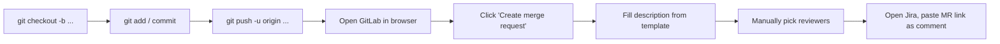
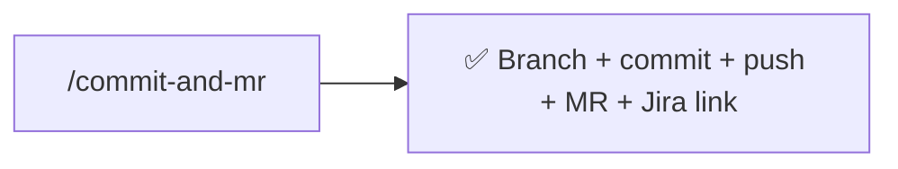

# commit-and-mr

Commit the working tree, push to a branch, and open a GitLab merge request — with reviewers picked from `git blame` and the related Jira issue updated, all in one command.

**Maintainer:** Josh Gibbs <joshuagibbs@paciolan.com>

### Old way



### New way



## Usage

The skill takes optional arguments — a branch name and/or a Jira key.

### As a slash command

```
/commit-and-mr
```

```
/commit-and-mr feat/strict-linting
```

```
/commit-and-mr feat/strict-linting jira=INVT-1234
```

```
/commit-and-mr jira=none
```

### As a natural-language skill

Trigger phrases:

> ship this

> commit and open an MR

> open a merge request for these changes

## What it does

1. Checks the current branch. If it's `master`/`main`/`develop`, creates a new branch (using your name or one it picks). Otherwise asks whether to branch off or use the current branch.
2. Reviews `git status` and `git diff`, stages the relevant changes, and writes a Conventional Commits message — including the Jira key if one is associated.
3. Pushes the branch to `origin` (with one retry on failure, then prompts you to check VPN).
4. Runs `git-blame-authors.py` to find authors of the modified code, resolves their emails to GitLab user IDs, and adds them as reviewers. Skips unresolved authors without blocking.
5. Assigns the MR to you and creates it.
6. If a Jira issue was associated, comments on it with the MR title and URL.

## Use cases

### Ship a small change end-to-end

```
/commit-and-mr
```

You're on `main` with uncommitted changes. The skill picks a branch name, commits, pushes, opens the MR with blame-derived reviewers, and links the MR back on Jira (if a key was provided).

### Pre-named branch

```
/commit-and-mr fix/cache-stale-keys
```

Same flow, but uses your branch name instead of inferring one.

### Skip Jira entirely

```
/commit-and-mr jira=none
```

For repo-only work (docs, CI, infra) that doesn't have a Jira ticket. The skill won't ask, won't prefix the commit, and won't try to comment anywhere.

### Continuing on an existing feature branch

If you're already on a non-default branch, the skill stops and asks whether to branch off or use the current branch — useful when iterating on a long-running feature.

## Tooling

Works with whatever you have configured:

- **GitLab MCP server** for resolving users and creating the MR
- `glab` and `git` for branch and push operations
- `python3` to run the bundled `git-blame-authors.py`
