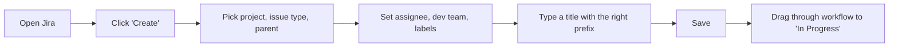
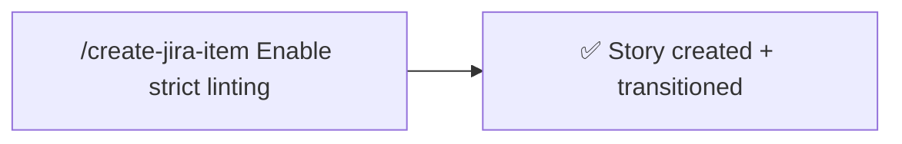

# create-jira-item

Create a Jira work item with all the right defaults — issue type, parent, dev team, labels, assignee, initial workflow status — without filling out the long form.

**Maintainer:** Josh Gibbs <joshuagibbs@paciolan.com>

### Old way



### New way



## Usage

Pass a title, or let the skill suggest one.

### As a slash command

```
/create-jira-item Enable strict linting
```

```
/create-jira-item
```

(no title — the skill proposes 3 options based on the current repo)

### As a natural-language skill

Trigger phrases:

> create a Jira item for this

> open a story to track strict linting

> file a ticket: refactor the pipeline

## What it does

1. Loads field defaults, transition IDs, and custom field mappings from the `jira-defaults` skill.
2. Picks the issue type — defaults to **Story** unless context says otherwise.
3. Determines the title:
    - If you passed one in `$ARGUMENTS`, uses it as-is.
    - Otherwise asks you to pick from 3 suggestions formatted as `<project-name>: <gitmoji> <title>` (e.g. `templates-ms: ♻️ refactor pipeline`).
4. Reads `package.json` to pull the project name — uses it as both the summary prefix and as a label. Skips the label if not in a repo.
5. Sets the parent (from `jira-defaults` if no other parent can be inferred).
6. Describes the work item to you before creating it.
7. Creates the issue via the Atlassian MCP server with all the defaults applied (assignee, dev team via `customfield_10055`, labels, etc.).
8. Transitions the new issue through to the target status (`In Progress` by default, falls back to `To Do`).
9. Reports the issue key, URL, summary, and current status.

## Use cases

### Quick story from the repo you're working in

```
/create-jira-item Add caching to the search endpoint
```

The story summary becomes `<repo-name>: Add caching to the search endpoint`, gets a label of the repo name, and lands in the right project under the right parent.

### Let the skill name it

```
/create-jira-item
```

Useful when you know what you're working on but don't want to write a title. The skill looks at the current repo state and proposes three formatted options — pick one or write your own via "Other".

### Outside a repo

```
/create-jira-item Investigate flaky CI
```

The skill skips the repo-name label and prefix but otherwise creates the item with full defaults.

## Tooling

- **Atlassian MCP server** is required. If it's not connected, the skill stops and tells you to install it.

## Configuration

All field defaults — project key, parent, assignee, dev team ID, transition IDs — live in the `jira-defaults` skill. Update that one file to change defaults across this skill and any others that depend on it. The repo's `package.json` `name` field drives both the summary prefix and the label.
