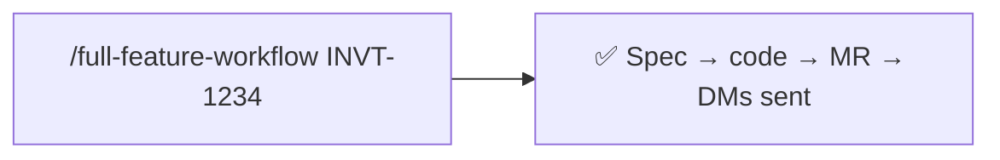
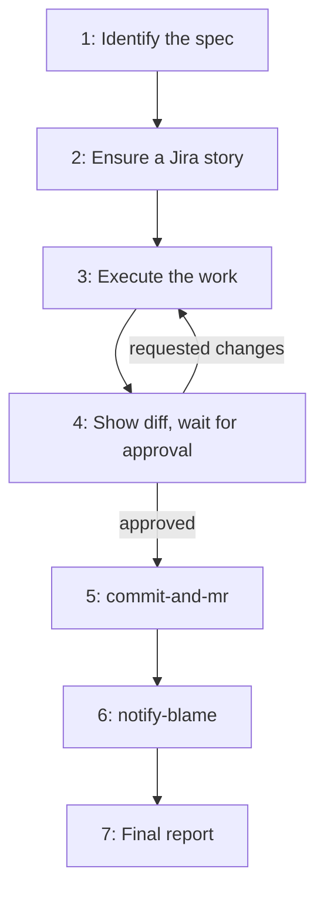

# full-feature-workflow

Run an entire feature end-to-end — Jira intake, code change, review hand-off, commit + MR, and Slack pings to blame authors — by orchestrating the other paciolan skills.

**Maintainer:** Josh Gibbs <joshuagibbs@paciolan.com>

### Old way


### New way



## Usage

Pass any kind of spec — Jira key, Confluence URL, file path, or a plain description.

### As a slash command

```
/full-feature-workflow INVT-1234
```

```
/full-feature-workflow https://paciolan.atlassian.net/wiki/spaces/ENG/pages/12345/Spec
```

```
/full-feature-workflow ./docs/specs/strict-linting.md
```

```
/full-feature-workflow Enable strict linting across all microservices
```

### As a slash command (resume)

This skill has **resume semantics** — if any sub-step stops (push fails, MR halts, you haven't approved yet), invoking the skill again picks up from the first incomplete step using context already in the conversation.

## What it does



1. **Identify the spec.** Resolves `$ARGUMENTS` to a concrete spec — Jira key (`getJiraIssue`), Confluence page (`getConfluencePage`), file path (`Read`), or plain description. Sets `JIRA_KEY`, `SPEC_TITLE`, `SPEC_BODY`, `SPEC_URL`. Asks for clarification if ambiguous.
2. **Ensure a Jira story.** If `JIRA_KEY` is already set, skips. Otherwise asks whether to create one and delegates to `create-jira-item`. Adds the spec body to the description and links the Confluence page if relevant.
3. **Execute the work.** Implements the change and runs project checks. Doesn't commit yet. After multiple Step 3↔4 loops, offers a checkpoint commit so uncommitted changes don't pile up.
4. **Wait for review.** Shows the diff and a one-paragraph summary, then stops. Only an unambiguous affirmative ("ship it", "lgtm", "approved") proceeds. Anything else loops back to Step 3.
5. **Commit and open MR.** Delegates to `commit-and-mr` with the resolved Jira key.
6. **Notify blame authors.** Delegates to `notify-blame` with the new MR URL.
7. **Final report.** Passes through `notify-blame`'s author table, plus the Jira link and MR URL.

## Use cases

### From a Jira ticket

```
/full-feature-workflow INVT-1234
```

Pulls the title and body from Jira, implements the change against that context, and commits with the key automatically baked into the message.

### From a Confluence spec

```
/full-feature-workflow https://paciolan.atlassian.net/wiki/.../page-id/Spec
```

Reads the page content, asks whether to create a Jira story (Confluence pages don't have one by default), and links the page back from the new issue.

### From a local file

```
/full-feature-workflow ./docs/specs/refactor-pipeline.md
```

Useful for specs that live in the repo. The file becomes `SPEC_BODY` and feeds into the new Jira story.

### From a free-form description

```
/full-feature-workflow Add request-id propagation through all middleware
```

Skips Jira lookup; asks whether to create a story from the description.

### Skipping Jira entirely

When asked, answer **No** to "Create a Jira story for this work?" — the skill will run the rest of the workflow with `JIRA_KEY=none`.

## Tooling

This skill is an orchestrator — it requires the sub-skills it delegates to:

- [`create-jira-item`](../create-jira-item/README.md)
- [`commit-and-mr`](../commit-and-mr/README.md)
- [`notify-blame`](../notify-blame/README.md)

It also reaches into Jira and GitLab directly. Works with whatever you have configured:

- **Atlassian MCP server** (preferred), or `acli jira`, or direct REST via `curl`
- **GitLab MCP server** (preferred), or `glab`, or direct REST via `curl`
