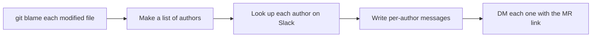
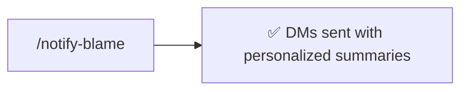

# notify-blame

DM every git blame author whose code was modified in the current branch, link them to the merge request, and include a personalized summary of what changed in their code.

**Maintainer:** Josh Gibbs <joshuagibbs@paciolan.com>

### Old way



### New way



## Usage

The skill takes an optional MR URL — usually it can find one on its own.

### As a slash command

```
/notify-blame
```

```
/notify-blame https://gitlabdev.paciolan.info/team/my-service/-/merge_requests/306
```

### As a natural-language skill

Trigger phrases:

> notify blame

> tell the blame authors

> ping the people whose code I modified

## What it does

1. Runs `git-blame-authors.py` against the current branch — outputs JSON with each author's name, email, line counts, file list, and per-author diff. The current user is excluded automatically.
2. Resolves the MR URL from (in order): the script's auto-detected `mrUrl`, the argument you passed, an URL mentioned earlier in chat, `glab mr list --source-branch=...`, or a final prompt to you.
3. Reads each author's diff and writes a brief, MR-author-perspective summary of what was changed in their code (e.g. *"Replaced your `AxiosOptions` interface with a direct import from axios"*).
4. Resolves each author's git email to a Slack user ID via the `person-to-user-map` skill (which checks the cache and falls back to `slack_search_users`).
5. Sends DMs in parallel with this format:

    ```
    :claude: **I touched your code!**
    No obligation, but you may be interested in reviewing [<repo-name>!<MR#>](<full MR URL>)

    > <personalized summary>
    ```

6. Reports a table of authors, line counts, and message status — including any author who couldn't be resolved on Slack.

## Use cases

### Standard ping after opening an MR

```
/notify-blame
```

You just opened an MR. The skill picks up the MR URL, finds blame authors, and DMs each of them with what specifically changed in their code.

### Explicit MR URL

```
/notify-blame https://gitlabdev.paciolan.info/team/my-service/-/merge_requests/306
```

When you're notifying after the fact, or running the skill from a checkout where the MR isn't tied to the current branch.

### No other authors touched

If `git-blame-authors.py` returns an empty `authors` list (you're the only one who's touched the modified lines), the skill stops and tells you so — no DMs sent.

## Tooling

- `python3` to run the bundled `git-blame-authors.py`
- `git` and `glab mr list` for MR URL detection
- **Slack MCP server** (`slack_search_users`, `slack_send_message`)
- **Optional**: improve performance with the [person-to-user-map](../person-to-user-map/README.md) skill

