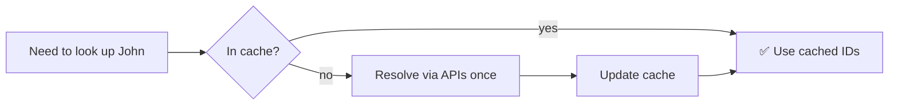

# person-to-user-map

A shared, on-disk cache mapping people to their identifiers across Slack, GitLab, and Jira. Used by every other skill that needs to look up a user — checked first, hits the platform APIs only on a miss.

**Maintainer:** Josh Gibbs <joshuagibbs@paciolan.com>

### Old way


### New way



## Usage

This skill is **not user-invocable**. It's invoked by other skills via the `Skill` tool whenever they need to map a person to a user ID.

If you want to add or correct an entry by hand, edit the YAML file directly:

```
$XDG_DATA_HOME/person-to-user-map.yaml
```

(usually `~/.local/share/person-to-user-map.yaml`)

## What it does

1. Reads the YAML cache at `$XDG_DATA_HOME/person-to-user-map.yaml`.
2. Looks up the requested person by name, nickname, or email.
3. On a miss, falls back to platform APIs:
    - **Slack**: `slack_search_users` — full name first, then email prefix.
    - **GitLab**: `mcp__*_gitlab__get_users` — first-initial + last name (`dsakamoto`), then full first + last (`joshuagibbs`), then first name only (`laercio`).
    - **Jira**: `mcp__claude_ai_Atlassian__lookupJiraAccountId` with `cloudId: paciolan.atlassian.net`, searched by full name.
4. Writes new entries back to the cache so subsequent lookups are free.

## Cache format

Each entry is a YAML object with the person's name, nicknames, emails, and platform IDs:

```yaml
- name: John Appleseed
  nicknames:
      - Jonny
  emails:
      - john@appleseed.com
  slack_id: U12345
  gitlab:
      id: 56481
      username: jappleseed
  jira_id: 81170:00000000-0000-4000-0000-000000000000
```

Any field can be missing — partial entries still save API calls on the platforms they do cover.

## Use cases

### Used by [notify-blame](../notify-blame/README.md)

To resolve each blame author's git email to a Slack user ID before sending DMs.

### Used by [commit-and-mr](../commit-and-mr/README.md)

To resolve blame authors' emails to GitLab user IDs for MR reviewer assignment, and to resolve `whoami` to a GitLab user ID for assigning the MR.

### Used by [create-jira-item](../create-jira-item/README.md)

To resolve assignees and reporters to Jira account IDs.

### Manual entry

If a teammate's first lookup happens to fail (unusual name, missing Slack profile, etc.), ask Claude to modify their cache entry manually.

You may also ask it to add notes such as:

> this user is an external FSL member, you can't message him directly but give me the message and I'll copy/paste it.

## Tooling

- **Slack MCP server** (`slack_search_users`)
- **GitLab MCP server** (`get_users`)
- **Atlassian MCP server** (`lookupJiraAccountId`)
