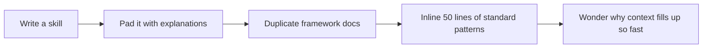
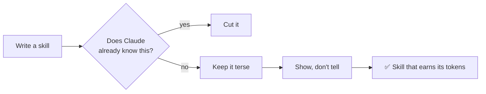

# write-claude-tooling

Token-efficient authoring rules for Claude Code configuration — the meta-skill that governs how every other skill, command, hook, and `CLAUDE.md` in this repo gets written. Not-quite-[Caveman](https://github.com/JuliusBrussee/caveman/blob/main/README.md), but for input tokens instead of output.

**Maintainer:** Josh Gibbs <joshuagibbs@paciolan.com>

### Old way



### New way



## Usage

This skill triggers automatically when you edit Claude Code configuration. You don't have to invoke it explicitly — it activates on path matches and trigger phrases.

### Trigger paths

- `**/CLAUDE.md`
- `**/AGENTS.md`
- `**/SKILL.md`
- `**/.claude/skills/**`
- `**/.claude/commands/**`
- `**/.claude/agents/**`
- `**/.claude/hooks/**`
- `**/.claude/settings*.json`

### Trigger phrases

> write a skill

> add a command

> update CLAUDE.md

> make a hook

> edit my agent

> improve this skill

## What it does

Applies four authoring principles to anything Claude writes for itself or another Claude:

1. **Only document what Claude doesn't know.** Project-specific conventions, custom code, non-obvious decisions. Not standard frameworks, common patterns, or language idioms. Test: _"Would Claude do the wrong thing without this?"_ If no, cut it.

2. **Prefer pointing to code over describing it.** `Read ./path/to/file.ts` or `@file` references beat duplicating content. If content is >5 lines and workflow-specific, put it in a skill and reference it. If 1-2 lines of universal context, inline in `CLAUDE.md`.

3. **Prefer scripts over instructions.** Deterministic tasks (setup, migrations, CI steps) belong in `.claude/scripts/`, referenced from commands. Scripts can't go stale — they either work or visibly break. Prose instructions silently rot.

4. **Show, don't tell.** One correct example replaces paragraphs of rules. Tables and bullets over prose.

## Use cases

### Writing a new skill

Skills are LLM-consumed docs. The frontmatter `description` lists trigger keywords, the body stays under ~80 lines, and steps are imperative — not explanations. This skill keeps you honest on all three.

### Editing `CLAUDE.md` / `AGENTS.md`

Group by concern. Link to skills for detail rather than inlining instructions. Cut anything Claude already knows from training.

### Reviewing existing tooling

Before editing, ask: _would removing this line cause Claude to do the wrong thing?_ If no, delete it. The skill encourages aggressive subtractive editing.

### Example: trim a verbose section

Before (47 tokens):

```
## Error Handling
- Always use specific exception classes from @nestjs/common
- Never use generic HttpException
- Pass an object with contextual information as the parameter
- Include a message property in the object
- Include a context property with ClassName/methodName format
```

After (25 tokens):

```
## Errors
Use specific `@nestjs/common` exceptions, not `HttpException`. Pass context objects:
`throw new BadRequestException({ message, context: \`${this.constructor.name}/${this.method.name}\` })`
```

Same information, half the tokens, and the example does the explaining.
